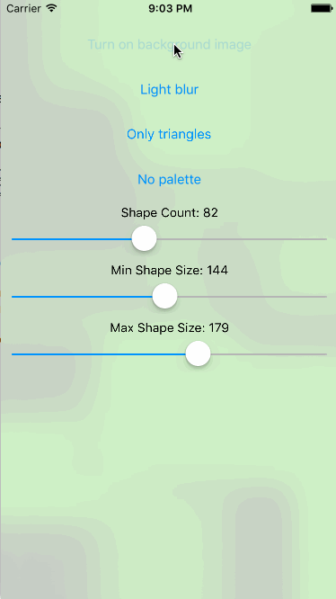
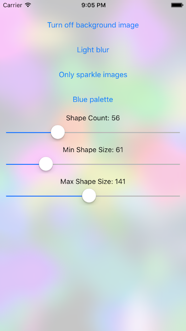
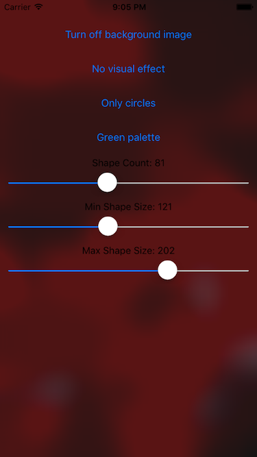
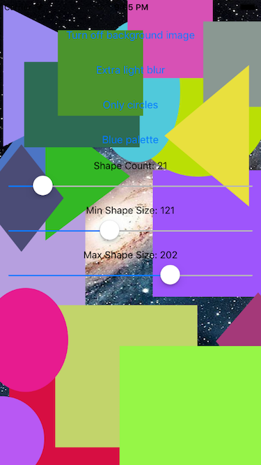

# AbstractView



(The quality issues are GIF-related, not related to this library)

  

<a href="https://github.com/Carthage/Carthage/issues/179">
    
</a>

`AbstractView ` is a simple `UIView` subclass that you can use as a background view to give some flavor compared to having just a plain white background. The way it works is by adding a bunch of abstract shapes (ovals, rectangles, etc.) and putting a `UIVisualEffectView` over the top of it. It's highly customizable, and can be extended in many ways, including the addition of other abstract shapes.

## Features

- Randomly generates abstract shapes and puts a visual effect view on top of it
- The visual effect can be customized
- Supports adding a custom background view to the abstract view
- The number of shapes can be customized
- The color palette of the generated shapes can be customized
- The size of the shapes can be customized
- Additional abstract shapes can be supported using `ShapeInitializer` closures
- The view is scalable and can be resized to fit orientation changes

## Requirements

- iOS 8.0+
- tvOS 9.0+
- Xcode 7+

## Installation using CocoaPods

[CocoaPods](http://cocoapods.org) is a dependency manager for Cocoa projects.

Because `AbstractView ` is written in Swift, you must use frameworks.

To integrate `AbstractView ` into your Xcode project using CocoaPods, specify it in your `Podfile`:

```ruby
source 'https://github.com/CocoaPods/Specs.git'
platform :ios, '8.0'
use_frameworks!

pod 'AbstractView'
```

Then, run the following command:

```bash
$ pod install
```

## Installation using Carthage

Add this to your `Cartfile`:

```
github "nuudles/AbstractView"
```

## Usage

Simply add an `AbstractView` into your view hierarchy. Note that any subviews should be added to the `AbstractView`'s `contentView`

```swift
let abstractView = AbstractView()
self.addSubview(abstractView)

abstractView.contentView.addSubview(mySubview)
```

Customize the number of abstract shapes by using the `shapeCount` property:

```swift
abstractView.shapeCount = 20
```

You can customize the size of the abstract shapes using the `minShapeSize` and `maxShapeSize` properties:

```swift
abstractView.minShapeSize = 50
abstractView.maxShapeSize = 100
```

Change the set of colors that can be assigned to the abstract shapes by using the `colorPalette` property:

```swift
abstractView.colorPalette = [UIColor(red: 0.0, green: 0.0, blue: 1.0, alpha: 1.0), UIColor(red: 0.0, green: 0.0, blue: 0.8, alpha: 1.0)]
```

Take a look at the Example project for more examples of how the abstract view can be customized.